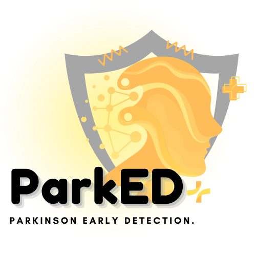

# 🧠 ParkED

<div align="center">
  
  
  <h2>🩺 AI-Powered Parkinson Screening Tool</h2>
  <p><em>ParkED: Parkinson Early Detecton System</em></p>
  
  [](https://laravel.com/)
  [](https://python.org/)
  [](https://tensorflow.org/)
  [](https://cloud.google.com/)
  
  **🌐 [Live Application]() | 🗨️ [Project Presentation]() | 🧬 [Research](research/)**
</div>

---

## 🌟 **Platform Overview**


---

## 🏗️ **System Architecture**

### 🔄 **Service Interaction Flow**


---

## 📁 **Repository Structure**

```

```

---

## 🚀 **Quick Start Guide**

### 📋 **System Requirements**

```bash
# Required Software


# Recommended Development Tools

```

### ⚡ **One-Command Setup**

```bash
# Clone the repository

# Option 1: Development Setup (Recommended)
./scripts/dev-setup.sh  # Coming soon!

# Option 2: Manual Setup (Current)
# See individual README files for detailed instructions
```

### 🔧 **Manual Development Setup**

#### 1️⃣ **Web Setup**
```bash

```
👉 **[Complete Web Guide](web/README.md)**

#### 2️⃣ **Diagnosis Service Setup**
```bash

```

👉 **[Complete Diagnosis Service Guide](services/diagnosis-service/README.md)**

#### 3️⃣ **Research Environment**
```bash

```
👉 **[Complete Research Guide](research/README.md)**

---

## 🌐 **Live Deployments**

### 🔴 **Production Services**

| Service | URL | Status | 
|---------|-----|--------|
| **🌐 Web** | []() | 🟢 Live | 
| **📊 Diagnosis Service** | []() | 🟢 Live | 

---

## 🎯 **Key Features**

### 🤖 **AI-Powered Screening**

```typescript
AI Features:
├── 🧠 Voice Measurement ( accuracy)
│   ├── 
│   ├── 
│   └── 
├── 📸 Handwriting Analysis ( accuracy)
│   ├── 
│   ├── 
│   └── 
└── 💬 Neuroimaging Analysis ( accuracy)
    ├── 
    ├── 
    └── 
```

---

## 💻 **Technology Stack**

<div align="center">

### 🎨 **Web Technologies**

### 🤖 **AI/ML Technologies**

### ☁️ **Cloud & DevOps**

</div>

---

## 🚀 **Getting Started**

### 🔥 **For Developers**


---

## 📄 **License**

This project is licensed under the **MIT License** - see the [LICENSE](https://choosealicense.com/licenses/mit/) here

```
MIT License - Open Source Freedom
├── ✅ Commercial use
├── ✅ Modification
├── ✅ Distribution
├── ✅ Private use
└── ❌ Liability & Warranty
```

---